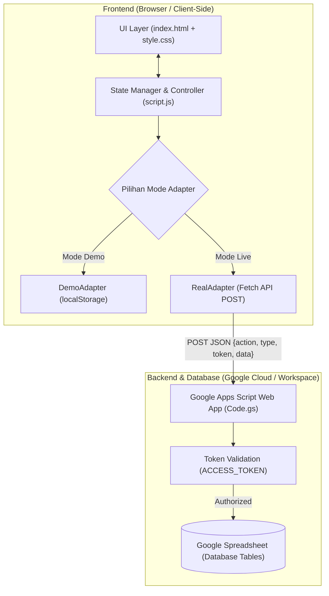

# Analisis Komprehensif Proyek: BK Digital (Simulasi BK)

> **Dokumen Analisis Arsitektur, Fitur, Keamanan, dan Rekomendasi Sistem**  
> **Tanggal Analisis:** 10 September 2026  
> **Target Aplikasi:** Sistem Informasi Bimbingan & Konseling Sekolah Berbasis Web (BK Digital)

---

## 1. Ringkasan Eksekutif & Identitas Proyek

**BK Digital** adalah aplikasi web *Single Page Application* (SPA) mandiri yang dirancang khusus untuk membantu Guru Bimbingan dan Konseling (BK) di tingkat sekolah (khususnya SMP/MTs/SMA) dalam mengelola administrasi siswa, pemantauan absensi, pencatatan pelanggaran, sesi konseling individu/kelompok, rekam jejak kolaborasi (panggilan ortu/home visit), hingga pemantauan program karakter **"7 Kebiasaan Anak Indonesia Hebat"**.

### Karakteristik Utama:
- **Zero Server Cost & Serverless Architecture:** Menggunakan Google Apps Script (GAS) sebagai API backend dan Google Sheets sebagai database utama.
- **Client-Side Heavy SPA:** Seluruh UI/UX dirender di browser menggunakan Vanilla HTML, CSS kustom, dan Vanilla JavaScript tanpa framework berat (React/Vue/Angular), menjadikannya sangat ringan, cepat dimuat, dan mudah di-hosting (misalnya di GitHub Pages).
- **Dual Mode (Real Backend & Offline Demo):** Mendukung koneksi live ke Google Sheets serta mode simulasi/demo mandiri (*localStorage*) tanpa konfigurasi server.

---

## 2. Struktur Berkas Repositori

```
simulasibk/
├── index.html           # Struktur layout SPA, modal, form template, dan komponen UI
├── script.js            # Inti logika frontend, state management, adapters, API caller, CRUD, charts, & event listeners
├── style.css            # Sistem desain kustom (Design Tokens, responsive layout, dark teal palette, media print)
├── PANDUAN-UPDATE.md    # Dokumentasi panduan instalasi Apps Script & update aman
├── appsscript.js        # File konfigurasi manifes Google Apps Script (appsscript.json)
└── analisa.md           # [Dokumen ini] Analisis menyeluruh arsitektur dan kapabilitas sistem
```

---

## 3. Arsitektur Sistem & Alur Data



### Penjelasan Pola Arsitektur:
1. **Pemisahan Total Kode & Data:** Kode frontend di-host terpisah (misalnya GitHub Pages / hosting statis), sedangkan data tersimpan di Google Sheets milik sekolah.
2. **Pola Adapter (Adapter Pattern):**
   - `RealAdapter`: Berkomunikasi dengan Google Apps Script Web App melalui HTTP `POST` dengan JSON payload. Menggunakan mekanisme keamanan token `ACCESS_TOKEN` di payload body (bukan URL query parameter).
   - `DemoAdapter`: Menyediakan mocking database penuh menggunakan `localStorage` dengan initial seeder data. Berguna untuk simulasi, demonstrasi, maupun pengujian tanpa jaringan internet.
3. **Pemuatan Batch (Batch Fetching & Bulk Insert):**
   - Menggunakan aksi `getAllBatch` untuk menarik 6 entitas data sekaligus dalam satu kali round-trip HTTP request, mengatasi keterlambatan *cold-start* Google Apps Script.
   - Menggunakan `bulkInsert` pada fitur absensi massal untuk menulis puluhan baris sekaligus dengan satu panggilan `setValues()` di Apps Script.

---

## 4. Analisis Modul & Fungsionalitas Aplikasi

### 4.1. Dashboard & Analisis Visual
- **Kartu Metrik KPI:** Total Siswa Terdaftar, Alpa Bulan Berjalan, Pelanggaran Bulan Berjalan, dan Sesi Konseling Bulan Berjalan.
- **Grafik Tren 6 Bulan (Chart.js):** Visualisasi perbandingan fluktuasi kasus pelanggaran vs ketidakhadiran (Alpa) dalam rentang 6 bulan terakhir.
- **Grafik Sebaran Pelanggaran:** Diagram batang horizontal menampilkan 6 kategori pelanggaran terbanyak.
- **Grafik Status Kehadiran:** Donut chart status absensi kumulatif (Hadir, Sakit, Izin, Alpa).
- **Feed Aktivitas Terbaru:** Timeline real-time gabungan dari absensi alpa, pelanggaran, konseling, dan kolaborasi teranyar.

### 4.2. Manajemen Data Siswa
- **Manajemen Entitas Siswa:** NIS, Nama Lengkap, Kelas, Jenis Kelamin, Tempat & Tanggal Lahir, Alamat, Nama Orang Tua, Nomor HP Orang Tua, dan Catatan Khusus.
- **Status Otomatis:** Status kedisiplinan otomatis (*Baik*, *Pemantauan*, atau *Perlu Perhatian*) dihitung berdasarkan frekuensi akumulasi kasus pelanggaran.
- **Import Massal Excel (`.xlsx` / `.xls`):**
  - Menggunakan library SheetJS (`xlsx.full.min.js`).
  - Fitur **Download Template Excel** untuk mempermudah format pengisian.
  - **Aturan Non-Destruktif:** Import menggunakan kunci pencocokan `NIS`. Siswa yang NIS-nya sudah terdaftar akan dilewati (*skipped*), sehingga data hasil input manual tidak pernah tertimpa.

### 4.3. Presensi & Notifikasi WhatsApp Orang Tua
- **Pencatatan Presensi Harian:** Tanggal, Siswa (via Combobox Picker), Status (Hadir, Sakit, Izin, Alpa), dan Keterangan.
- **Fitur Absen Massal per Kelas:**
  - Guru dapat memilih satu kelas, memilih status (misal: *Hadir*), dan mencentang semua siswa sekaligus.
  - Mencegah duplikasi data absensi untuk siswa dan tanggal yang sama.
- **Integrasi WhatsApp Otomatis (Manual Direct `wa.me`):**
  - Tombol WhatsApp pada baris absensi untuk mengirim pesan konfirmasi kehadiran ke nomor orang tua/wali siswa.
  - Pemformatan nomor otomatis ke kode negara Indonesia (`62xxxxxxxxxxx`).
  - 100% gratis tanpa biaya API pihak ketiga / gateway SMS berbayar.

### 4.4. Rekam Jejak Pelanggaran & Sistem Poin
- Pencatatan kasus pelanggaran dengan tanggal, jenis pelanggaran, pembobotan poin, keterangan kronologi, dan tindakan penanganan yang telah diambil pihak sekolah.
- Filter data interaktif berdasarkan kelas dan periode bulan.

### 4.5. Layanan Konseling & Kasus Siswa
- Rekam proses bimbingan konseling: Topik, Nama Konselor/Guru BK, Uraian Masalah, Hasil Konseling, dan Rencana Tindak Lanjut (*Follow-up*).
- Ditampilkan dalam format *Card List* yang rapi dengan indikator avatar inisial nama siswa.

### 4.6. Kolaborasi Sekolah & Orang Tua / Pihak Luar
- Fasilitas dokumentasi kerja sama penanganan siswa:
  - **Pemanggilan Orang Tua**
  - **Home Visit (Kunjungan Rumah)**
- Menyimpan tujuan kunjungan/panggilan, kesepakatan/hasil, serta nama petugas BK pelaksana.

### 4.7. Program "7 Kebiasaan Anak Indonesia Hebat"
- Modul pemantauan pembiasaan karakter peserta didik sesuai instrumen pembiasaan nasional:
  1. **Bangun Pagi** (Jam bangun)
  2. **Beribadah** (Sholat 5 waktu checklist, Sholat Dhuha, Tadarus/Murajaah, Ibadah lainnya)
  3. **Berolahraga** (Jenis olahraga & durasi menit)
  4. **Gemar Belajar** (Mata pelajaran yang dipelajari)
  5. **Makan Sehat & Bergizi** (Menu makanan)
  6. **Bermasyarakat** (Aktivitas sosial/lingkungan)
  7. **Istirahat Cukup** (Jam tidur/istirahat malam)
  8. **Verifikasi:** Paraf Orang Tua, Paraf Guru BK/Wali Kelas, dan Catatan Evaluasi Guru.
- Fitur **Cetak Formulir Harian**: Menghasilkan tata letak cetak (*print-ready*) yang persis seperti blangko formulir kertas aslinya.

### 4.8. Mesin Pelaporan & Cetak PDF
- **Jenis Laporan yang Didukung:**
  - Data Siswa
  - Rekap Absensi (dilengkapi kartu total Hadir, Sakit, Izin, Alpa)
  - Rekap Pelanggaran (dilengkapi total kasus & akumulasi poin)
  - Rekap Konseling
  - Rekap Kolaborasi
  - Rekap 7 Kebiasaan
  - **Laporan Individu Terpadu per Siswa:** Menggabungkan seluruh data riwayat absensi, pelanggaran, konseling, kolaborasi, dan kebiasaan seorang siswa dalam satu lembar cetak komprehensif.
- **Filter Periode:** Fleksibel (Semua Tanggal, Harian, atau Bulanan).
- **Media Print Ready:** Menggunakan CSS `@media print` khusus yang secara otomatis menyembunyikan navigasi web dan memformat tabel/dokumen untuk dicetak atau disimpan sebagai PDF.

### 4.9. Pencarian Cerdas & Navigasi Cepat
- **Pencarian Global di Topbar:**
  - Memfilter tabel/kartu pada halaman yang aktif secara instan.
  - Menampilkan dropdown hasil pencarian siswa lintas halaman dengan ringkasan statistik siswa (jumlah kasus & alpa) serta shortcut tombol *"Lihat Laporan Individu"* dan *"Catat Absensi"*.
- **Siswa Picker Combobox:** Komponen custom dropdown pencarian siswa di dalam modal form dengan filter kelas terintegrasi.

### 4.10. Backup Database Menyeluruh (Excel Multi-Sheet)
- Fitur ekspor data cadangan di menu Pengaturan yang mengunduh seluruh 6 sheet (`Siswa`, `Absensi`, `Pelanggaran`, `Konseling`, `Kolaborasi`, `Kebiasaan`) ke dalam **satu file Excel (.xlsx)** utuh dengan timestamp otomatis.

---

## 5. Analisis Keamanan & Integritas Data

| Aspek Keamanan | Implementasi di Proyek | Tingkat Efektivitas |
| :--- | :--- | :--- |
| **Proteksi XSS (Cross-Site Scripting)** | Fungsi utilitas `escapeHtml()` diterapkan secara konsisten pada setiap injeksi string dinamis ke dalam `innerHTML` / template string. | **Tinggi (Aman)** |
| **Autentikasi API Backend** | Parameter `token` (`ACCESS_TOKEN`) diverifikasi di Google Apps Script via `PropertiesService.getScriptProperties()`. Request tanpa token yang cocok akan ditolak. | **Tinggi** |
| **Penyimpanan Kredensial** | URL API dan Token disimpan di `localStorage` peramban pengguna. Tidak ada token yang di-*hardcode* ke repositori publik GitHub. | **Sangat Baik** |
| **Transmisi Payload** | Token dan payload dikirim lewat HTTP `POST` body (bukan URL query parameter `GET`), mencegah kebocoran token di riwayat browser / log web proxy. | **Sangat Baik** |
| **Integritas Penulisan Data** | Backend Apps Script memetakan pembaruan kolom berdasarkan array header sheet (`headers.indexOf(key)`). Kolom yang tidak terdaftar diabaikan sehingga struktur sheet tidak rusak. | **Tinggi** |
| **Isolasi Organisasi** | Opsi deployment Apps Script *"Anyone within [Google Workspace Organization]"* memungkinkan isolasi akses hanya untuk domain akun sekolah resmi (`@sekolah.sch.id`). | **Enterprise Grade** |

---

## 6. Analisis Desain Antarmuka (UI/UX)

1. **Design Tokens & Color Palette:**
   - Warna Primer: Deep Teal (`#2F6F63` & `#234F46`) – memberikan kesan profesional, tenang, dan terpercaya.
   - Warna Aksen: Warm Amber (`#E0932F`) – untuk perhatian dan status peringatan.
   - Warna Status: Soft Danger Coral (`#D9614F`), Positive Green (`#3E9A63`), Soft Info Blue (`#3B7DD8`).
   - Tipografi: Kombinasi **Plus Jakarta Sans** (Heading/Display) dan **Inter** (Body text) untuk legibilitas optimal.
2. **Responsivitas & Tata Letak Seluler:**
   - **Desktop Layout:** Sidebar tetap (*sticky* 240px) dengan ruang kerja tabel yang lega.
   - **Mobile / Tablet Layout:** Sidebar otomatis tersembunyi, digantikan oleh **Bottom Navigation Bar** untuk akses cepat, dilengkapi tombol *"Lainnya"* yang membuka drawer/sheet modal yang halus (*slide-up sheet*).
3. **Komponen Aksesibilitas:**
   - Indikator visual fokus (`:focus-visible`).
   - *State feedback* instan menggunakan animasi transisi CSS, toast notification interaktif, dan modal loading overlay.

---

## 7. Struktur Skema Data (Google Sheets)

Aplikasi mengelola 6 sheet database dengan kolom default sebagai berikut:

```
├── [Sheet: Siswa]
│   └── ID, NIS, Nama, Kelas, JenisKelamin, TempatTglLahir, Alamat, NamaOrtu, NoHPOrtu, Catatan
├── [Sheet: Absensi]
│   └── ID, Tanggal, SiswaID, Nama, Kelas, Status, Keterangan
├── [Sheet: Pelanggaran]
│   └── ID, Tanggal, SiswaID, Nama, Kelas, JenisPelanggaran, Poin, Keterangan, Penanganan
├── [Sheet: Konseling]
│   └── ID, Tanggal, SiswaID, Nama, Kelas, Topik, Konselor, Masalah, HasilKonseling, TindakLanjut
├── [Sheet: Kolaborasi]
│   └── ID, Tanggal, SiswaID, Nama, Kelas, Jenis, Petugas, Tujuan, Hasil
└── [Sheet: Kebiasaan]
    └── ID, Tanggal, SiswaID, Nama, Kelas, BangunPagiPukul, IbadahSholat, IbadahDhuha, 
        IbadahTadarus, IbadahLainnya, OlahragaJenis, OlahragaDurasi, BelajarMapel, 
        MakanMenu, BermasyarakatKegiatan, IstirahatPukul, ParafOrtu, ParafGuru, CatatanGuru
```

---

## 8. Analisis SWOT (Kekuatan, Kelemahan, Peluang, Tantangan)

### Kekuatan (Strengths):
- Biaya operasional $0 (gratis selamanya dengan Google Drive/Sheets gratisan atau Google Workspace for Education).
- Sangat portabel: frontend dapat diakses dari browser manapun tanpa perlu instalasi aplikasi atau database server (MySQL/PostgreSQL).
- Kemudahan pemeliharaan: Guru dan staf dapat mengedit data langsung lewat Google Sheets jika terjadi keadaan darurat.
- Fitur lengkap mencakup seluruh domain kerja guru bimbingan konseling di Indonesia.

### Kelemahan (Weaknesses):
- Batasan kuota Google Apps Script: Waktu eksekusi maksimum 6 menit per request dan batas kuota panggilan per hari (meski umumnya sangat cukup untuk skala 1 sekolah).
- Belum mendukung *multi-role authentication* granular di sisi frontend (misal: akun Siswa vs Guru BK vs Kepala Sekolah).
- Seluruh pemrosesan filter dan sorting saat ini berbasis client-side memory (`STATE`).

### Peluang (Opportunities):
- Implementasi **PWA (Progressive Web App)** dengan *Service Worker* untuk caching offline penuh.
- Penambahan grafik evaluasi kepribadian & sosiometri siswa.
- Penambahan export PDF langsung ke file tanpa melalui dialog cetak browser (menggunakan jsPDF / html2pdf).

### Tantangan (Threats):
- Ketergantungan pada stabilitas layanan Google Workspace / Apps Script.
- Kebijakan CORS atau pembatasan jaringan di lingkungan jaringan intranet sekolah tertentu.

---

## 9. Rekomendasi Pengembangan Lanjutan

1. **Progressive Web App (PWA) & Offline Sync:**
   - Menambahkan file `manifest.json` dan `sw.js` agar aplikasi dapat di-install di layar utama HP guru/wali kelas seperti aplikasi native.
2. **Manajemen Akun & Role-Based Access Control (RBAC):**
   - Menyediakan layer akses login berjenjang (Admin BK, Wali Kelas, Kepala Sekolah) untuk membatasi akses pengubahan data sensitif.
3. **Paginasi Tabel Sisi Klien: [SELESAI DITERAPKAN]**
   - Komponen reusable pagination telah diimplementasikan pada tabel Data Siswa, Absensi Siswa, dan Pelanggaran (pilihan 10/25/50/100 baris, smart ellipsis, navigasi halus) untuk menjaga performa render DOM tetap ringan dan responsif.
4. **Visualisasi Radar Chart Karakter: [SELESAI DITERAPKAN]**
   - Diagram radar (*Spider Chart*) 7 dimensi karakter telah diintegrasikan pada Laporan Individu Siswa, lengkap dengan kalkulasi rasio keterlaksanaan dan dukungan cetak PDF.

---
*Dokumen ini dibuat otomatis sebagai hasil inspeksi dan telaah arsitektur kode sumber proyek BK Digital.*
